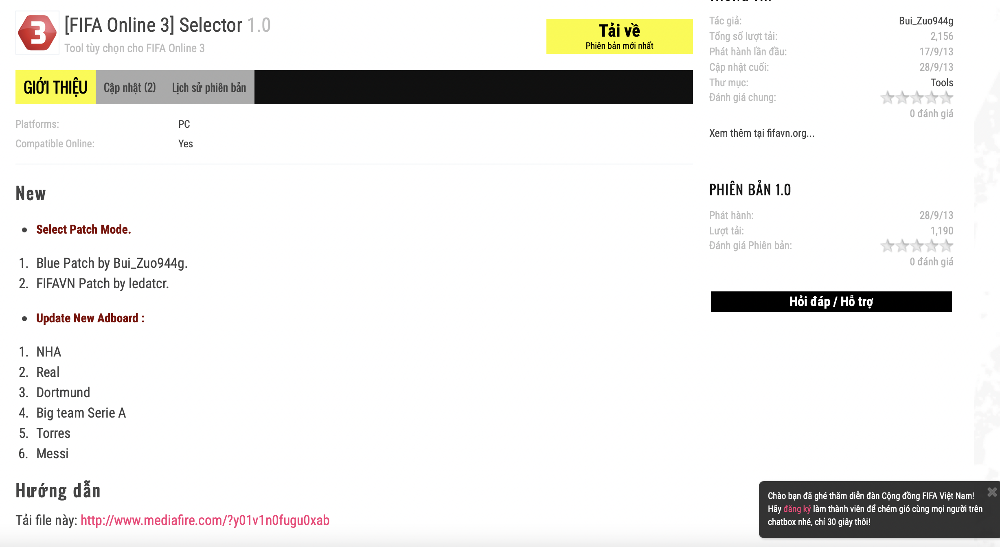
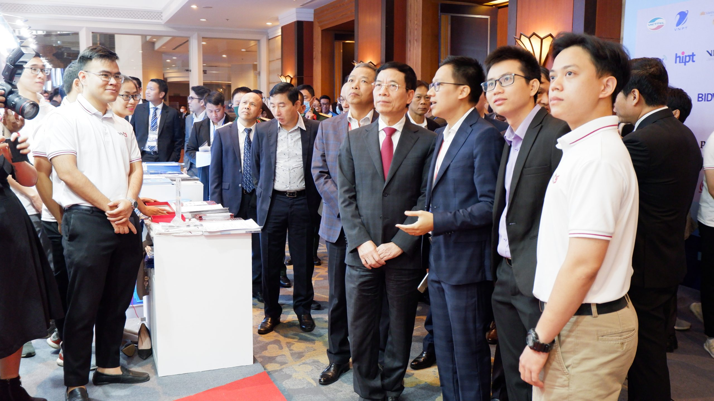
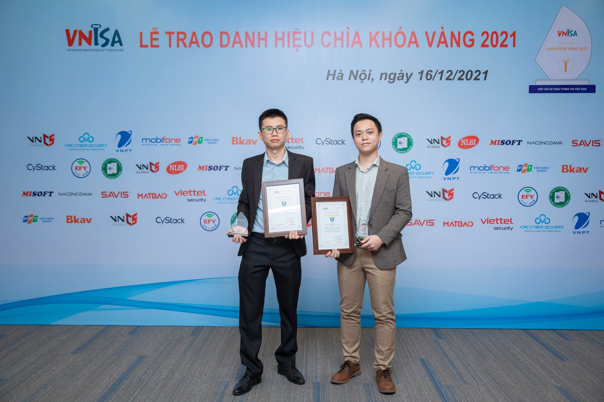
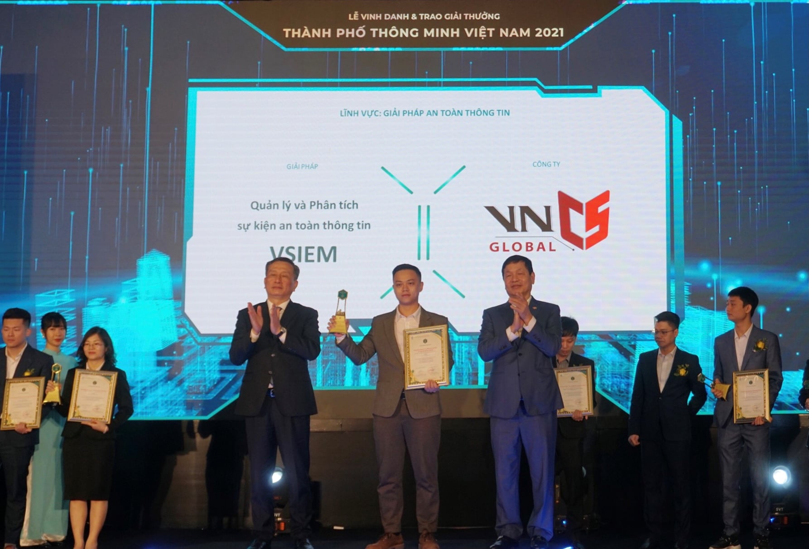

**Xin chao**, **Hello**,

My name is Duong or you guys can call me John. I was born in Vietnam but am a global citizen.

Currently, I am working as a **Software Engineer**, **Cloud Engineer**, and **Cyber Security Engineer**. My skill set is focused on **Research**, **Software Development**, and **System Operation**.

### I love Technologies
I win **2 competitions** (one was 1st runner with a 20/20 score) in competitive programming (as you may know, I used to write the programs in Pascal) when I was studying in High school. Then I decided to keep chasing my dream to become a Software Engineer.

My first program was a tool written in C# when I was 16 (my nickname was BuiZuo944g XD)

I went to the Academy of Cryptography Techniques, where I learned to become a **Security Engineer**. Here, I publish my very first paper with my teacher, Mr. Tung, to [Tạp chí Nghiên cứu Khoa học và Công nghệ quân sự (JMST)](https://www.jmst.info)

[You can find my paper here](assets/paper/masked_aes_friem.pdf)

### My very first steps as a Engineer...
... was joined one of the most known **Cyber Security** companies in Vietnam. Here, I was playing as a **Cyber Security Consultant**, **Solution Engineer**, **Security Engineer**, and **Software Developer**.

Play as a **Software Developer** and then as a **Product Owner**, my biggest project in the company - **VSIEM** - won 2 valuable awards from **VNISA** and **VINASA**.

It was an awesome journey, I learned a lot from my CTO and colleagues. I left my ex. company after 3 years working together.

### Go global
My second (and current) company is one of the biggest companies in the world. Very happy to be a part of it. 
I am working as an IoT/Cloud Engineer

## My Projects
...TBC...
